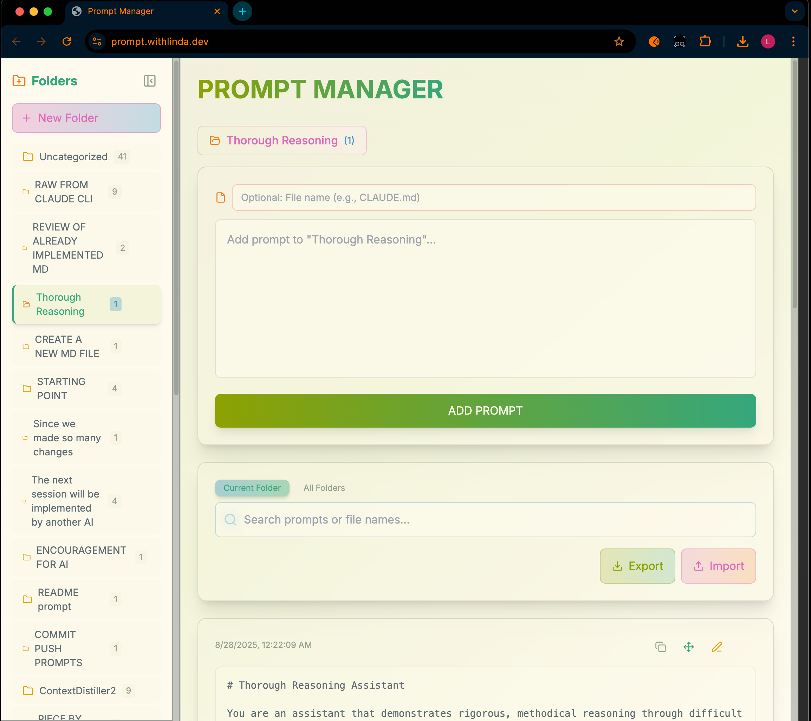

# Prompt Manager

A Next.js application for organizing and managing AI prompts in a hierarchical folder structure with import/export capabilities.



## What It Does

Prompt Manager helps you organize, store, and access your AI prompts efficiently. Create folders, categorize prompts, and maintain a searchable library of your frequently used AI instructions.

## Why It's Useful

- **Organization**: Structure prompts in nested folders for easy navigation
- **Persistence**: Automatically saves to browser's local storage
- **Portability**: Export/import your entire prompt library as markdown files
- **Search**: Quickly find prompts across all folders
- **Copy-Ready**: One-click copy for any prompt

## Installation

```bash
npm install
npm run dev
```

Open [http://localhost:3000](http://localhost:3000) in your browser.

## How to Use

### Managing Folders
- Click **"New Folder"** to create a folder
- Select a folder to view its contents
- Use folder buttons to rename or delete

### Managing Prompts
- Click **"ADD PROMPT"** to create a new prompt
- Fill in the prompt text in the editor
- Your prompts save automatically

### Import/Export
- **Export**: Downloads all prompts as markdown files organized by folder structure
- **Import**: Upload markdown files to add prompts to your library

### Keyboard Shortcuts
- Search: Focus the search bar to filter prompts by name
- Copy: Click any prompt to copy it to clipboard

## Tech Stack

- Next.js 15
- React 19
- TypeScript
- Tailwind CSS
- Local Storage for persistence